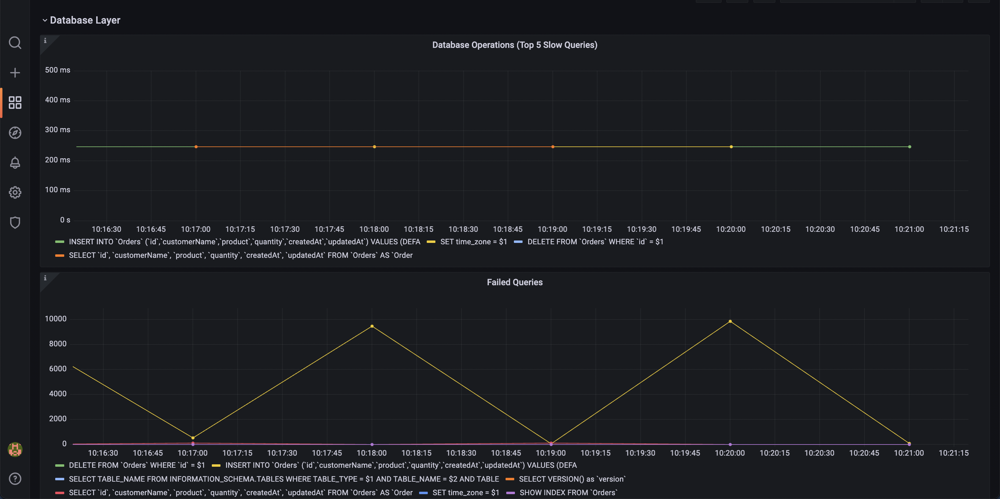

# @last9/openapm

## Installation

```
npm install --save @last9/openapm@latest
```

## Usage

In the example below, the metrics will be served on `localhost:9097/metrics`. To
change the port, you can update it through the options
([See the options documentation](#options)).

```js
const express = require('express)
const { OpenAPM } = require('@last9/openapm')

const app = express();
const openapm = new OpenAPM();

app.use(openapm.REDMiddleware);

// ...

app.listen(3000)

```

## Options

### Usage

```js
const openapm = new OpenAPM({
  // Options go here
});
```

1. `path`: The path at which the metrics will be served. For eg. `/metrics`
2. `metricsServerPort`: (Optional) The port at which the metricsServer will run.
3. `environment`: (Optional) The application environment. Defaults to
   `production`.
4. `defaultLabels`: (Optional) Any default labels to be included.
5. `requestsCounterConfig`: (Optional) Requests counter configuration, same as
   [Counter](https://github.com/siimon/prom-client#counter) in `prom-client`.
   Defaults to
   ```js
   {
      name: 'http_requests_total',
      help: 'Total number of requests',
      labelNames: ['path', 'method', 'status'],
    }
   ```
6. `requestDurationHistogramConfig`: (Optional) Requests Duration histogram
   configuration, same as
   [Histogram](https://github.com/siimon/prom-client#histogram) in
   `prom-client`. Defaults to
   ```js
    {
        name: 'http_requests_duration_milliseconds',
        help: 'Duration of HTTP requests in milliseconds',
        labelNames: ['path', 'method', 'status'],
        buckets: promClient.exponentialBuckets(0.25, 1.5, 31),
      }
   ```

## Setup locally

Make sure you are in the express directory

- Install packages

```
npm install
```

- Build package

  - This will build the package and store the JS and type declaration files in
    the `dist` folder.

```
npm run build
```
# Grafana Dashboard View



# About Last9

[Last9](https://last9.io) builds reliability tools for SRE and DevOps.

<a href="https://last9.io"></a>
